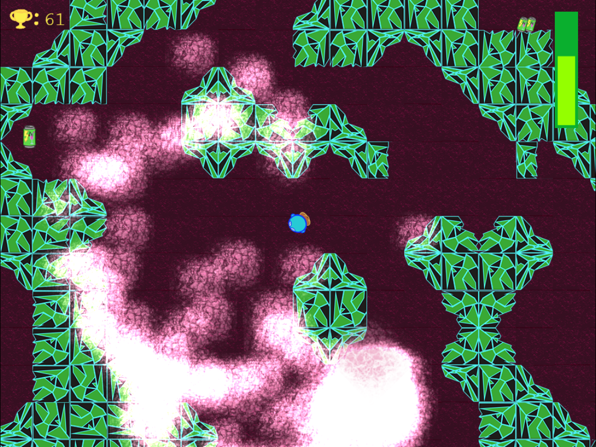

# [What the Fog Runner](https://example.com/)



---

Mr. Wobble WTF Runner Adventure

The amazing adventure starts with Mr. Wobble eating too much radioactive chili yesterday, well, maybe that doesn't have anything to do with our story, maybe that's  a tale for a prequel...

Today Mr. Wobble decided to stop cursing. It's been one of his bad habits ...  :(

To be successful, he decided to start his good deed with only saying "What the Fooooog!!!", but little did he know his friendly neighborhood fog (who are in no way connected to the chili) did not enjoy it, and thus begins the endless adventure of running away from a gang of angry fog! 

## How to run

Install [nodejs](https://nodejs.org) (> 6.0)

Change into cloned repository directory and install necessary packages
```sh
npm install
```
Run the project 
```sh
npm start
```
>   **HINT**: If you prefer yarn, run `yarn start` instead.

## Package Scripts

The following package scripts are also available to manage your project:

>   **HINT**: If you prefer yarn, run these scripts with `yarn` instead.

```sh
npm run clean     # Manually deletes previous distribution files.
npm run dist      # Prepares the game for distribution.
npm run format    # Uses ESLint to format and remove lint issues.
npm run lint      # Checks scripts for lint issues using ESLint.
```
